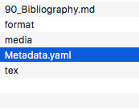

# Einführung

adasd asdsa ads ad s

## Motivation

Super! **FETT**^[Das ist eine Fußnote.]
[@Fielding2000]

[@Schindler2013]

{#fig:test width=50%}

Wie in Bild (siehe [[@fig:test]](#fig:test))

  Right     Left     Center     Default
-------     ------ ----------   -------
     12     12        12            12
    123     123       123          123
      1     1          1             1

Table:  Demonstration of simple table syntax. {#tbl:test2}

$i_{2} = 2$

Siehe [[@tbl:test2]](#tbl:test2) sdfds dsf sdfsdf dsf kldsfjdsf kljsdfjksdfjlkdsf kldfs lkdjsf klsdf jsdf ksdf kljsdf jsdfldksfj sdfkldsfklds lkds dsfkl jfsd kldjfsdjsdklfkldj soiqw roxcm,nckqwpo lj dlksdfj sdjd

## Zielsetzung

sdf

## Methodik

sdf

## Gang der Untersuchung

sdfsdf

